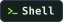
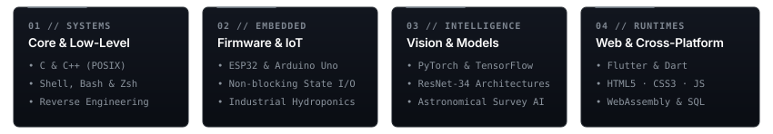

  

 

  

Software developer and systems researcher based in Spain, specializing in low-level computing architectures, applied deep learning, reactive embedded firmware, and modern web structure. My technical practice focuses on deterministic systems, algorithmic efficiency, and complete vertical software pipelines: from bare-metal microcontrollers (ESP32, AVR), low-level C/C++, and automation scripting across Shell environments (Bash, PowerShell, Zsh), to production neural network architectures with PyTorch and TensorFlow, structured relational data persistence with SQL, and responsive client-facing interfaces engineered with Flutter, WebAssembly, and core web technologies (HTML5, CSS3, JavaScript).

  
  
  
  
  
  
  
  
  
  
  
  

  

 

  

  

<table>
  <thead>
    <tr>
      <th width="100%">Commercial &amp; Industrial Systems</th>
    </tr>
  </thead>
  <tbody>
    <tr>
      <td valign="top">
        <h3>Greenhouse Automation — Rosal IMPORT-EXPORT SL</h3>
        

          
          
          
          
          
          
        

        

          Industrial-grade automation system deployed for Rosal IMPORT-EXPORT SL to control precision hydroponic feeding and conventional soil crop environments. Orchestrates multi-sensor data acquisition, valve actuation, and climate regulation through deterministic ESP32 firmware written in C++, backend telemetry processing in Python, and declarative YAML configuration matrices.
        

      </td>
    </tr>
  </tbody>
</table>

 

  

  

<table>
  <thead>
    <tr>
      <th width="50%">Project Specification</th>
      <th width="50%">Project Specification</th>
    </tr>
  </thead>
  <tbody>
    <tr>
      <td valign="top">
        <h3><a href="https://github.com/RaulSalasSahuquillo/nova-engine">NovaTrade — Financial Simulation Engine</a></h3>
        

          
          
          
          
          
        

        

          Cross-platform real-time market and investment simulator built with Flutter and Dart. Designed to train traders through realistic market dynamics using real historical and live stock data without financial risk. Engineered for high-throughput chart rendering across Windows, Linux, and Android.
        

        

          
          
        

      </td>
      <td valign="top">
        <h3><a href="https://github.com/RaulSalasSahuquillo/nasa-deep-space-classifier">NASA Deep Space Classifier</a></h3>
        

          
          
          
          
          
          
          
        

        

          End-to-end deep learning and computer vision pipeline engineered to harvest, classify, and catalog astronomical survey imagery from NASA &amp; MAST archives using a ResNet-34 convolutional backbone with SQLite metric logging. Public model weights published as <code>astroclass_ai</code>.
        

        

          
          
        

      </td>
    </tr>
    <tr>
      <td valign="top">
        <h3><a href="https://github.com/RaulSalasSahuquillo/algorithms-and-architectures-arm-to-quantum">Algorithms &amp; Architectures: Systems to Quantum</a></h3>
        

          
          
          
          
        

        

          Research codebase (TdR) evaluating computational models from the hardware up. Spans bare-metal execution, instruction-level performance analysis, physical automation interfaces, and algorithmic scaling simulations toward quantum supremacy benchmarks.
        

        

          
        

      </td>
      <td valign="top">
        <h3><a href="https://github.com/RaulSalasSahuquillo/smart-home-automation-system">Smart Home Perimeter Security</a></h3>
        

          
          
          
        

        

          Asynchronous smart perimeter defense and gate automation engine built on AVR/Arduino Uno. Implements deterministic non-blocking finite state machines to ensure real-time sensor polling and motor actuation without halting the primary event loop.
        

        

          
        

      </td>
    </tr>
    <tr>
      <td valign="top" colspan="2">
        <h3><a href="https://github.com/RaulSalasSahuquillo/PIXELTOWN">PIXELTOWN &amp; Multiplatform Compilation</a></h3>
        

          
          
          
          
          
          
          
          
        

        

          Modular 2D game engine and interactive environment built for collaborative extensions. Features a multi-target deployment pipeline compiling from desktop Python/Pygame into native Android APK packages and browser-based WebAssembly runtimes via Pygbag.
        

        

          
        

      </td>
    </tr>
  </tbody>
</table>

 

  

  

### Systems &amp; Low-Level Core

  
  
  
  
  
  
  
  
  
  

### Quantum Computing Research

  
  
  
  

### Embedded Hardware &amp; Industrial IoT

  
  
  
  
  
  
  

### Artificial Intelligence &amp; Data Engineering

  
  
  
  
  
  
  
  
  
  
  
  

### Web Structure &amp; Multiplatform Interfaces

  
  
  
  
  
  
  
  
  
  
  
  
  
  

 

  

  

  <table>
    <thead>
      <tr>
        <th align="center">Platform</th>
        <th align="center">Endpoint</th>
      </tr>
    </thead>
    <tbody>
      <tr>
        <td align="center"></td>
        <td align="center"><a href="https://raulsalassahuquillo.github.io/">raulsalassahuquillo.github.io</a></td>
      </tr>
      <tr>
        <td align="center"></td>
        <td align="center"><a href="https://huggingface.co/RaulSalasSahuquillo">huggingface.co/RaulSalasSahuquillo</a></td>
      </tr>
      <tr>
        <td align="center"></td>
        <td align="center"><a href="https://github.com/RaulSalasSahuquillo">github.com/RaulSalasSahuquillo</a></td>
      </tr>
      <tr>
        <td align="center"></td>
        <td align="center"><a href="https://www.youtube.com/@RaulSalasSahuquillo">youtube.com/@RaulSalasSahuquillo</a></td>
      </tr>
      <tr>
        <td align="center"></td>
        <td align="center"><a href="mailto:raulsalassahuquillo.dev@gmail.com">raulsalassahuquillo.dev@gmail.com</a></td>
      </tr>
    </tbody>
  </table>

 

  

